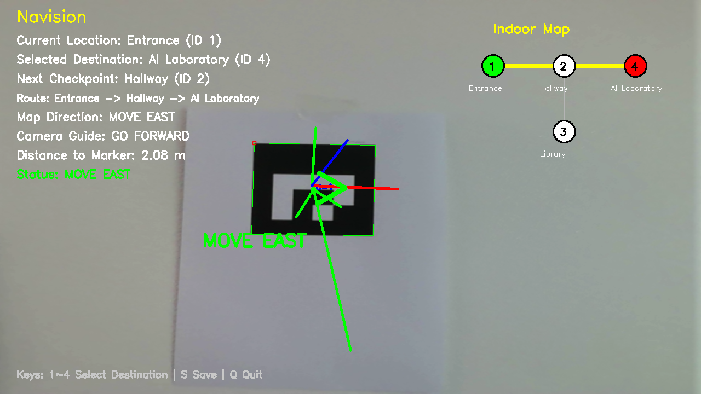
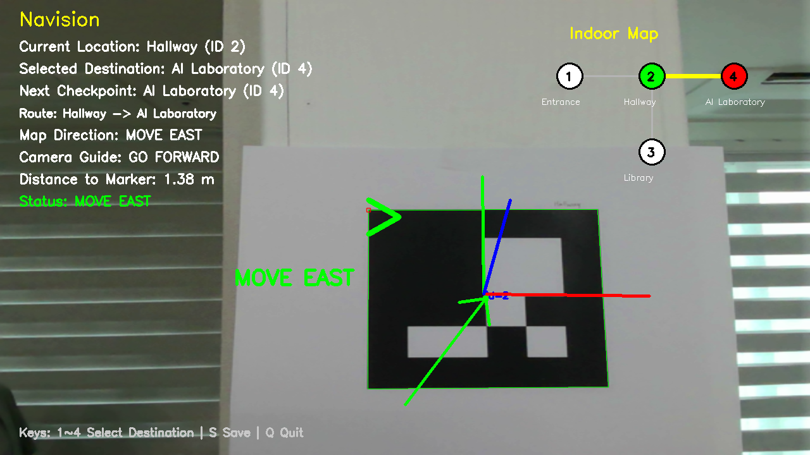
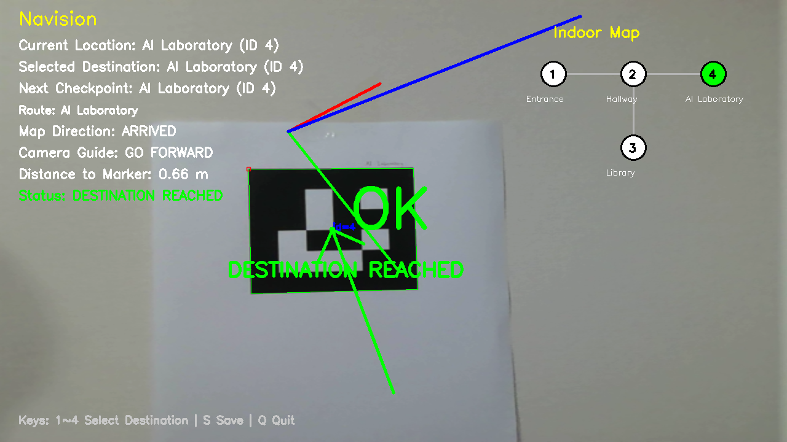

# Navision

**Indoor AR Navigation System using Computer Vision and ArUco Markers**

---

## Project Overview

Navision is an indoor augmented reality (AR) navigation system developed using Computer Vision techniques and ArUco markers.

Unlike GPS-based navigation systems, which often perform poorly in indoor environments, Navision uses ArUco markers as indoor landmarks to identify the user's current location and provide navigation guidance toward a selected destination.

The system combines marker detection, pose estimation, route planning, and AR visualization to create a simple indoor navigation experience.

---

## Motivation

Most navigation systems rely on GPS to estimate a user's location and provide route guidance. However, GPS signals are often unreliable or unavailable in indoor environments such as shopping malls, department stores, airports, libraries, and large office buildings.

While visiting large indoor spaces, people often spend a significant amount of time searching for specific stores, facilities, or destinations. This experience inspired the idea of exploring an alternative navigation approach that does not depend on GPS.

Navision was developed as an experimental indoor navigation system that combines computer vision and augmented reality technologies. By using ArUco markers as indoor landmarks, the system can identify a user's current location, estimate the relative position of the camera, and provide route guidance toward a selected destination.

The goal of this project is to demonstrate how marker-based localization, route planning, and AR visualization can be combined to create an indoor navigation experience. Although the current implementation is a prototype, it highlights the potential of computer vision techniques for future indoor navigation systems.

---

## Features

- Camera Calibration
- ArUco Marker Detection
- Pose Estimation using OpenCV
- Distance Estimation
- Interactive Destination Selection
- Graph-Based Route Planning (BFS)
- Coordinate-Based Direction Guidance
- Indoor Mini-Map Visualization
- Destination Reached Detection
- Screenshot Capture

---

## System Architecture

### Indoor Locations

| Marker ID | Location      |
| --------- | ------------- |
| 1         | Entrance      |
| 2         | Hallway       |
| 3         | Library       |
| 4         | AI Laboratory |

### Indoor Graph

```text
Entrance (1)
      |
Hallway (2)
   /       \
Library(3)  AI Laboratory(4)
```

The navigation route is calculated using Breadth-First Search (BFS) on the predefined indoor graph.

---

## How It Works

1. The camera captures live video.
2. ArUco markers are detected in real time.
3. The current location is identified from the detected marker.
4. The user selects a destination using keyboard input (1~4).
5. The shortest route is calculated using BFS.
6. Navigation information is displayed as an AR overlay.
7. The system notifies the user when the destination is reached.

---

## Usage

### Run Marker Generator

```bash
python marker_generator.py
```

### Run Navigation System

```bash
python navision.py
```

### Keyboard Controls

```text
1 : Entrance
2 : Hallway
3 : Library
4 : AI Laboratory

S : Save Screenshot
Q : Quit Program
```

---

## Demo Results

### Navigation from Entrance to AI Laboratory



The system identifies the current location, calculates the route, and displays the next checkpoint.

---

### Navigation from Hallway to AI Laboratory



The route is updated according to the current checkpoint and destination.

---

### Destination Reached



The system detects that the user has arrived at the selected destination and displays a completion message.

---

## Challenges and Lessons Learned

During development, several practical issues were encountered.

### 1. Marker Detection Stability

Marker detection accuracy was affected by lighting conditions, viewing angles, and camera movement.

To improve stability, printed markers were used instead of displaying markers on a mobile screen.

### 2. Pose Estimation Compatibility

Different OpenCV versions provided different ArUco APIs.

Some functions used in older versions were unavailable, requiring alternative pose estimation methods using solvePnP.

### 3. Indoor Navigation Design

Implementing a complete indoor navigation system is significantly more complex than simple marker detection.

The project was redesigned as a graph-based navigation prototype that demonstrates the core concepts of indoor localization and route guidance.

---

## Project Structure

```text
NAVISION
│
├── navision.py
├── marker_generator.py
├── calibration_result.npz
├── requirements.txt
├── README.md
│
├── markers
│   ├── marker_1.png
│   ├── marker_2.png
│   ├── marker_3.png
│   └── marker_4.png
│
└── screenshots
    ├── navision_demo_1.png
    ├── navision_demo_2.png
    ├── navision_demo_3.png
    └── navision_demo_4.png
```

---

## Libraries

- Python 3
- OpenCV
- NumPy

Install dependencies:

```bash
pip install opencv-contrib-python numpy
```

---

## References

This project was developed using the following resources:

- OpenCV Documentation
  https://docs.opencv.org/

- OpenCV ArUco Detection Tutorial
  https://docs.opencv.org/4.x/d5/dae/tutorial_aruco_detection.html

- OpenCV Camera Calibration Tutorial
  https://docs.opencv.org/4.x/dc/dbb/tutorial_py_calibration.html

- NumPy Documentation
  https://numpy.org/doc/

---

## Future Improvements

The current implementation demonstrates a prototype indoor navigation system.

Future improvements include:

- Real-time indoor localization using multiple markers
- Automatic indoor map generation
- Dynamic route planning
- Large-scale indoor map support
- Mobile AR deployment
- SLAM-based localization
- Markerless indoor navigation

---

## Author

Jimin You

Navision: Indoor AR Navigation System using Computer Vision and ArUco Markers
